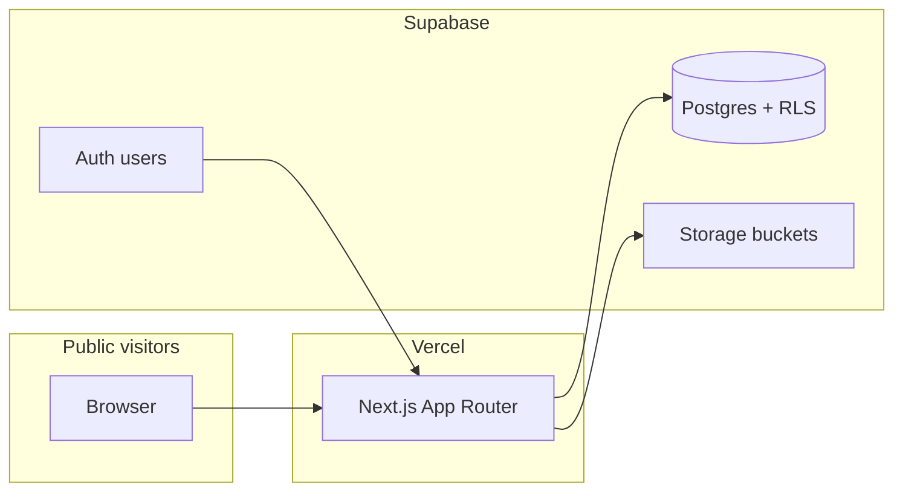

# BringingTruth — Modular NGO Landing + Lightweight CMS

## Goals

- **Public site**: Mission, Vision, **Company Updates** (blog-style), **Mission Highlights**, **Testimonies**, **Contact** (and a prominent **Donate** CTA pointing to your external giving URL).
- **Maintainability**: IT updates copy and media through a **simple admin** (CRUD), not Git/code deploys.
- **Stack**: Next.js, ShadCN UI, Tailwind, Vercel, Supabase; domain on NameCheap (DNS → Vercel).

**Recommendation**: Treat this as a **separate Next.js repo** (or `apps/bringingtruth` in a monorepo) from heavy internal ERP work so deployments, env vars, and access stay simple for the NGO.

---

## High-level architecture




- **Public routes**: Server Components fetch published content from Supabase (read-only policies).
- **Admin routes**: e.g. `/admin/*` — protected; mutations via **Server Actions** (session check → write). No `app/api/` except if you add webhooks later.

---

## Phase 1 — Foundation (repo, design system, deploy)

1. **Bootstrap**: `create-next-app` (App Router, TypeScript, Tailwind), add **ShadCN** (`components.json`), `**@supabase/ssr`**, `**zod`**, `**lucide-react**` (icons per your standards).
2. **Layout & brand**: One design direction (typography, spacing, accessible contrast) — NGO-appropriate, not “generic SaaS purple.” Reusable sections in `src/components/` or `src/features/marketing/`.
3. **Environments**: Vercel project + Preview/Production; Supabase project (dev + prod or branches if you use Supabase branching).
4. **Domain**: NameCheap → point **A/ALIAS/CNAME** per [Vercel custom domains](https://vercel.com/docs/concepts/projects/domains); enable HTTPS in Vercel.

---

## Phase 2 — Supabase data model (content + security)

Design tables for **minimal CRUD** and clear ownership:


| Area               | Suggested tables                                                           | Notes                                                                                                                            |
| ------------------ | -------------------------------------------------------------------------- | -------------------------------------------------------------------------------------------------------------------------------- |
| Mission / Vision   | `site_settings` (key/value or JSON) or `organization_profile` (single row) | IT edits text in admin; public page reads one row.                                                                               |
| Updates (blog)     | `posts`                                                                    | `title`, `slug`, `excerpt`, `body` (markdown or rich JSON), `cover_image_path`, `published_at`, `status` (`draft` / `published`) |
| Mission highlights | `mission_highlights`                                                       | `title`, `body`, `image_path`, `sort_order`, `published`                                                                         |
| Testimonies        | `testimonies`                                                              | `author_name`, `quote` or `body`, `image_path`, `sort_order`, `published`                                                        |
| Contact            | `contact_submissions`                                                      | Store form rows (name, email, message, `created_at`); optional notification email later                                          |


**Security (non-negotiable)**:

- **RLS on every table**: e.g. `anon`/`authenticated` **SELECT** only where `published = true` / `status = 'published'`; **INSERT/UPDATE/DELETE** only for users in an `admin` role (via `profiles.role` or JWT claim).
- **Storage buckets** (`public-assets` or scoped buckets): public read for published images; write restricted to admins via RLS policies on `storage.objects`.
- **Auth for admin**: Start with **1–3 Supabase users** (IT) — email + password or magic link. Avoid building a complex RBAC; a single `admin` role is enough for “minor CRUD.”

---

## Phase 3 — Public website (pages & sections)

Thin routes under `src/app`, content from features:


| Route             | Purpose                                                                                                                                                     |
| ----------------- | ----------------------------------------------------------------------------------------------------------------------------------------------------------- |
| `/`               | Hero, Mission, Vision, Highlights teaser, Testimonies teaser, Latest updates, Donate CTA (external URL from env `NEXT_PUBLIC_DONATION_URL`), Contact teaser |
| `/updates`        | List of published posts                                                                                                                                     |
| `/updates/[slug]` | Post detail                                                                                                                                                 |
| `/contact`        | Form → Server Action → insert `contact_submissions`                                                                                                         |


Optional: `/mission`, `/testimonies` if you want long-form pages; otherwise keep everything on the home page with anchors.

**SEO**: `metadata` in layouts, `sitemap.ts`, `robots.ts`, Open Graph images per post if you store cover URLs.

---

## Phase 4 — Admin UI (IT-friendly)

- **Location**: e.g. `/admin` (layout with auth gate — middleware or server layout checking `supabase.auth.getUser()` + role).
- **Patterns**: List + “New” + edit form per resource; use ShadCN **Form**, **Dialog**, **Table**, **Sonner** toasts; validate with Zod in Server Actions.
- **Content editing**: Prefer **Markdown + preview** (simple, portable) or a lightweight editor; avoid dumping raw HTML from non-technical users unless trained.
- **Media**: Upload to Supabase Storage from admin; save **path** in DB; render with Next.js `Image` where possible (remote patterns in `next.config`).

No need for a third-party headless CMS if Supabase + this admin covers blogs/highlights/testimonies — fewer vendors, one bill, full control.

---

## Phase 5 — Donations (your choice: external)

- **Day one**: Primary **Donate** button(s) open `NEXT_PUBLIC_DONATION_URL` (PayPal, GCash page, Tithe.ly, etc.).
- **Contact form**: Separate from giving — questions, prayer requests, partnership; optional future step: email notifications (Resend/SendGrid) or Supabase Edge Function — not required for MVP.

---

## Phase 6 — Handoff to IT (documentation checklist)

Short internal doc (not user-facing product copy):

- How to log in to `/admin`
- How to create a post, upload an image, set **Published**
- Where the **donation URL** is changed (env in Vercel)
- Who to call if locked out (Supabase auth reset)

---

## Risk & scope notes

- **PCI / payments**: External donation link keeps you out of card data scope on your app.
- **GDPR/privacy**: Privacy policy page + cookie banner if you add analytics (Plausible/Umami are lighter than GA for small NGOs).
- **Backup**: Enable Supabase **Point-in-time recovery** on paid tier if content is critical; periodic CSV export of tables as a fallback.

---

## Suggested folder shape (modular)

```
src/
  app/
    (marketing)/page.tsx
    updates/[slug]/page.tsx
    contact/page.tsx
    admin/...
  features/
    marketing/     # sections: Hero, MissionVision, Highlights, Testimonies
    cms/           # admin screens + server actions for posts, highlights, testimonies
  lib/supabase/    # client.ts, server.ts (@supabase/ssr)
  types/
```

This mirrors your Project Revive conventions (feature folders, thin routes, Server Actions for mutations) while staying a separate product.

---

## Implementation order (summary)

1. Next + ShadCN + Tailwind + deploy to Vercel (stub homepage).
2. Supabase schema + RLS + Storage policies + seed admin user.
3. Public pages wired to read published content.
4. Admin CRUD for posts, highlights, testimonies, org copy.
5. Contact form + env-based donation URL.
6. SEO, polish, accessibility pass, IT handoff doc.

